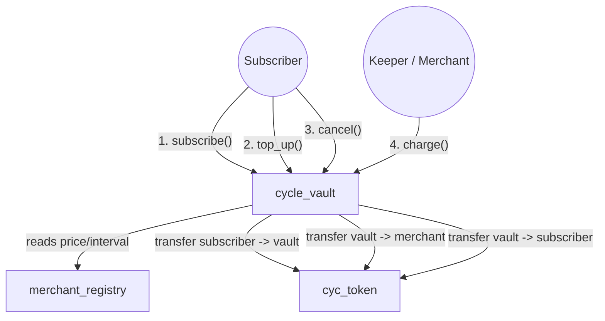
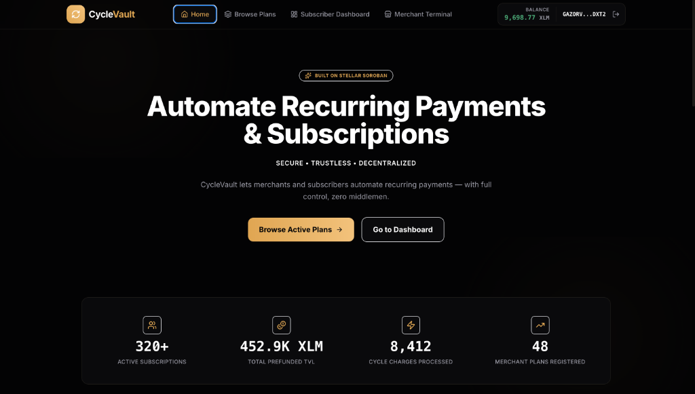
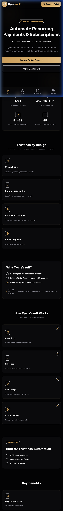
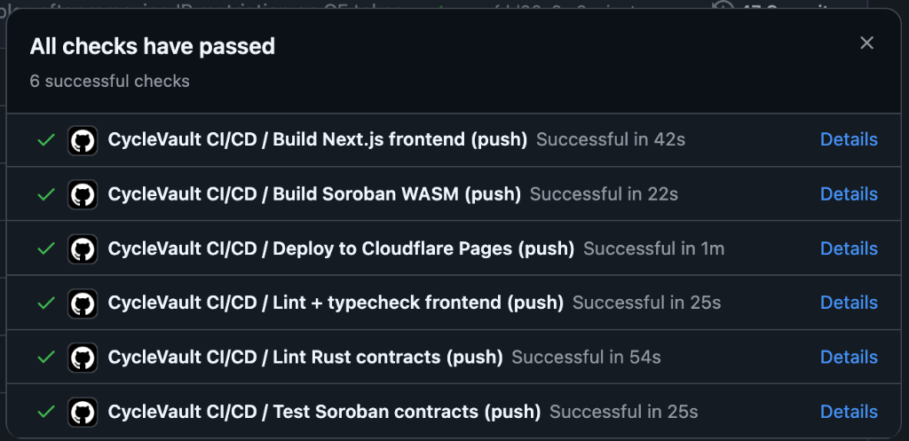

# CycleVault


**Live Demo:** [https://cyclevault-5nu.pages.dev/](https://cyclevault-5nu.pages.dev/)  
**Demo Video (1–2 min):** [CycleVault Demo GIF](screenshots/demo_video.gif)

---

## Project Description

CycleVault is a production-grade decentralized subscription and recurring billing protocol built on the Stellar blockchain using Soroban smart contracts. It enables trustless pull-payments where a subscriber pre-funds a dedicated cycle vault with CYC utility tokens, and a merchant is permitted to pull one payment per billing cycle. 

Unlike traditional subscriptions that require custodian trust or off-chain cron databases, CycleVault gives the subscriber complete ownership: they can cancel at any moment to receive their remaining vault balance refunded on-chain instantly, or top up their balance dynamically.

---

## Architecture

CycleVault utilizes a modular, three-contract architecture to separate merchant profiles, user vault balances, and utility tokens.

### Call Graph Diagram



---

## Tech Stack

| Layer | Technology |
|---|---|
| **Smart Contracts** | Rust + Soroban SDK (Protocol 22+, target `wasm32v1-none`) |
| **Frontend Framework** | Next.js 14 (App Router, static export), TypeScript |
| **Wallet Integration** | `@stellar/freighter-api` (Freighter Wallet) |
| **Blockchain Gateway** | `@stellar/stellar-sdk` (Stellar SDK) |
| **Styling Base** | Tailwind CSS (slate monochromatic theme) |
| **CI/CD** | GitHub Actions |
| **Test Client** | Vitest (frontend), Cargo (contracts) |

---

## Smart Contracts (Testnet)

All smart contracts have been compiled and successfully deployed to the Stellar Testnet:

| Contract | Address | Stellar Expert Link |
|---|---|---|
| **Merchant Registry** | `CDQQNDJI4CNDQCOT2PFN3Z2T5RGWDILOYR44WTMKZ5M5CNOY3EDOEPB7` | [Explorer Address](https://stellar.expert/explorer/testnet/contract/CDQQNDJI4CNDQCOT2PFN3Z2T5RGWDILOYR44WTMKZ5M5CNOY3EDOEPB7) |
| **Cycle Vault** | `CAYBQLDD2ZNQKGWDGFZ4QAPMBJSS6ZGQWIW3WBBRNRA6ZRKRUCAW6ZCC` | [Explorer Address](https://stellar.expert/explorer/testnet/contract/CAYBQLDD2ZNQKGWDGFZ4QAPMBJSS6ZGQWIW3WBBRNRA6ZRKRUCAW6ZCC) |
| **XLM Asset Contract (SAC)** | `CDLZFC3SYJYDZT7K67VZ75HPJVIEUVNIXF47ZG2FB2RMQQVU2HHGCYSC` | [Explorer Address](https://stellar.expert/explorer/testnet/contract/CDLZFC3SYJYDZT7K67VZ75HPJVIEUVNIXF47ZG2FB2RMQQVU2HHGCYSC) |
| **CYC Token (Optional Utility)** | `CDNGXULKNHSKXR7KZOSCZINNHXUKAFWFIO7XTZ267IY23MOSWZWUI3KC` | [Explorer Address](https://stellar.expert/explorer/testnet/contract/CDNGXULKNHSKXR7KZOSCZINNHXUKAFWFIO7XTZ267IY23MOSWZWUI3KC) |

---

## Inter-Contract Calls

CycleVault utilizes genuine cross-contract calls to calculate billing parameters and custody funds:
1. **Plan Parameters Retrieval:** During `subscribe()` and `charge()`, the `cycle_vault` contract calls `merchant_registry`'s `get_plan(plan_id)` via `env.invoke_contract` to fetch the latest active status, billing interval, and price.
2. **Custody & Transfer:** During `subscribe()`, `top_up()`, `charge()`, and `cancel()`, the `cycle_vault` contract invokes `cyc_token`'s `transfer` method to pull deposits from the subscriber, pay the merchant, or refund the cancellation balance.

### Verified Testnet Transactions

Every action is verified on-chain. Below are direct links to active execution receipts:
* **Contract Deployments:**
  * Merchant Registry Deploy: [`88d8815ba8c51913ab76e82de33db7735d4e0471df61c1c13a0f4affef745523`](https://stellar.expert/explorer/testnet/tx/88d8815ba8c51913ab76e82de33db7735d4e0471df61c1c13a0f4affef745523)
  * Cycle Vault Deploy: [`7458f3d1788d5adf51840ca56130a3d4d88d79d58c855f40d91696b027228bb1`](https://stellar.expert/explorer/testnet/tx/7458f3d1788d5adf51840ca56130a3d4d88d79d58c855f40d91696b027228bb1)
* **Contract Initialization:**
  * Merchant Registry Init: [`a28af0f2e0f2331255dbf78dd953eec4b25737f69d4092776518bc2b57d18c3d`](https://stellar.expert/explorer/testnet/tx/a28af0f2e0f2331255dbf78dd953eec4b25737f69d4092776518bc2b57d18c3d)
  * Cycle Vault Init: [`674fd5423b9b943cd7d3b91966f1df006a0201074941f7d9963da79eb7264630`](https://stellar.expert/explorer/testnet/tx/674fd5423b9b943cd7d3b91966f1df006a0201074941f7d9963da79eb7264630)
* **On-Chain Action Triggers:**
  * Create Billing Plan (CYC Token): [`a4eedbb81a37c3531826755eaf85b9c5320279c7f2cd6e8b50e590f574e68d92`](https://stellar.expert/explorer/testnet/tx/a4eedbb81a37c3531826755eaf85b9c5320279c7f2cd6e8b50e590f574e68d92)
  * Token Allowance Approval: [`4622f4d38e509e63d01c1ea46399eff9b16504c718d56ab771dc878e196b7941`](https://stellar.expert/explorer/testnet/tx/4622f4d38e509e63d01c1ea46399eff9b16504c718d56ab771dc878e196b7941)
  * Subscribe to Plan: [`1a25b6e332e0ebd342c366143cf57383897551869710f06a40134152626996e6`](https://stellar.expert/explorer/testnet/tx/1a25b6e332e0ebd342c366143cf57383897551869710f06a40134152626996e6)
  * Process Billing Charge: [`3fd451a273d01c3e3e5e867aab9cb8d15d63092c65ecdc08ed1c43f022d78bde`](https://stellar.expert/explorer/testnet/tx/3fd451a273d01c3e3e5e867aab9cb8d15d63092c65ecdc08ed1c43f022d78bde)
  * Cancel Subscription: [`f28ca12c4a5d51113f999dc569216dd0e5bd2e73c39b996a855111badf1f10e2`](https://stellar.expert/explorer/testnet/tx/f28ca12c4a5d51113f999dc569216dd0e5bd2e73c39b996a855111badf1f10e2)

---

## Wallet Connection

Freighter wallet (`@stellar/freighter-api`) is used for connection and signature authorization:
1. Connects on Testnet mode.
2. Formats and displays native balances and addresses.
3. Automatically prompts Freighter signature popups during contract interactions (subscribe, cancel, top up, charge).

---

## Core Mechanics

* **No-Native-Cron Pull Billing:** Soroban has no automatic scheduler. "Auto-payment" means the contract exposes a permissionless `charge(caller, sub_id)` method. Anyone can run this method (e.g. the merchant, a keeper bot, or a frontend collect button). The contract prevents early collections by throwing `Error::TooEarly` if the elapsed time is less than `plan.interval` since `last_charge`.
* **Prefunded Vaults:** Subscribers fund their vaults in advance. The contract locks these tokens, verifying that `balance >= plan.price` before permitting a charge.
* **Refund Guarantee:** If a subscriber decides to cancel, they call `cancel()`, which automatically refunds all remaining uncharged tokens in the vault to the subscriber's wallet address.

---

## Error Handling

The application handles various runtime states with explicit, friendly UI prompts:

| Condition | Error Source | UI Representation |
|---|---|---|
| Freighter not installed | Browser | Link to download extension |
| Ledger mismatch | Freighter | "Switch to Testnet in Freighter" |
| Double charging too early | Smart Contract (`TooEarly`) | Disabled button showing "Not Due Yet" with countdown |
| Insufficient prefund | Smart Contract (`InsufficientBalance`) | Warning: "Insufficient CYC balance to collect" |
| Plan deactivated by merchant | Smart Contract (`PlanInactive`) | Status: "This plan is no longer active" |
| Signature cancelled | Freighter | Toast warning: "Transaction signature rejected in wallet" |

---

## Screenshots

### 1. Main Landing Page (Obsidian-Gold Tech Theme)


### 2. Mobile Responsive UI Layout


### 3. Automated CI/CD Pipeline


---

## Setup Instructions

### Prerequisites
* Node.js v20+
* Rust & Cargo toolchain
* Stellar CLI (`stellar` v27.0.0+)
* Freighter Wallet extension

### Local Setup
1. Clone the repository:
   ```bash
   git clone https://github.com/vidit/CycleVault.git
   cd CycleVault
   ```
2. Set up and run contract tests:
   ```bash
   cargo test --all
   ```
3. Run the local testnet deploy script:
   ```bash
   chmod +x deploy.sh
   ./deploy.sh
   ```
4. Start the Next.js frontend:
   ```bash
   cd frontend
   npm install
   npm run dev
   ```
   Open `http://localhost:3000` to interact.

---

## Testing

### Smart Contract Tests (20 tests)
Run contract-level tests verifying plan CRUD, subscribe/charge/cancel/top-up flows, timing enforcement, price updates, and list queries:
```bash
cargo test --all
```
*Output:*
```
running 20 tests
test test::test_01_plan_creation_and_get_plan ... ok
test test::test_02_update_price_requires_merchant_auth ... ok
test test::test_03_set_active_toggles_plan_status ... ok
test test::test_04_list_plans_for_merchant ... ok
test test::test_05_subscribe_pulls_correct_prefund_amount ... ok
test test::test_06_subscribe_against_inactive_plan_fails ... ok
test test::test_07_subscribe_with_insufficient_prefund_fails ... ok
test test::test_08_charge_before_interval_elapses_fails ... ok
test test::test_09_charge_succeeds_after_interval ... ok
test test::test_10_charge_drains_vault_correctly_across_multiple_cycles ... ok
test test::test_11_charge_on_cancelled_subscription_fails ... ok
test test::test_12_charge_on_insufficient_balance_fails ... ok
test test::test_13_charge_on_deactivated_plan_fails ... ok
test test::test_14_cancel_refunds_exact_remaining_balance ... ok
test test::test_15_cancel_by_non_subscriber_fails ... ok
test test::test_16_top_up_increases_balance_without_resetting_last_charge ... ok
test test::test_17_top_up_cancelled_subscription_fails ... ok
test test::test_18_next_charge_in_returns_correct_values ... ok
test test::test_19_price_change_picked_up_on_next_charge ... ok
test test::test_20_list_subscriptions_for_subscriber_and_merchant ... ok

test result: ok. 20 passed; 0 failed; 0 ignored; 0 measured; 0 filtered out; finished in 0.33s
```

### Frontend Tests
Run Vitest checks for countdown math and data parser utils:
```bash
npm --prefix frontend run test
```
*Output:*
```
Test Files  1 passed (1)
      Tests  7 passed (7)
   Start at  19:52:41
   Duration  171ms
```

---

## License

This project is licensed under the MIT License.
